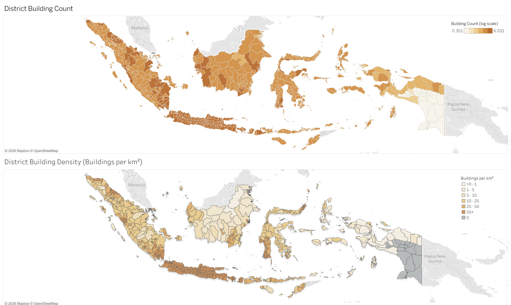
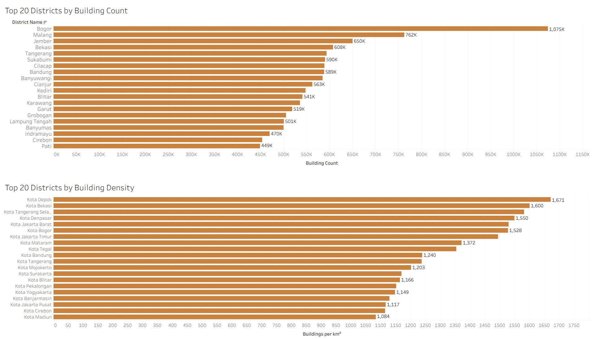
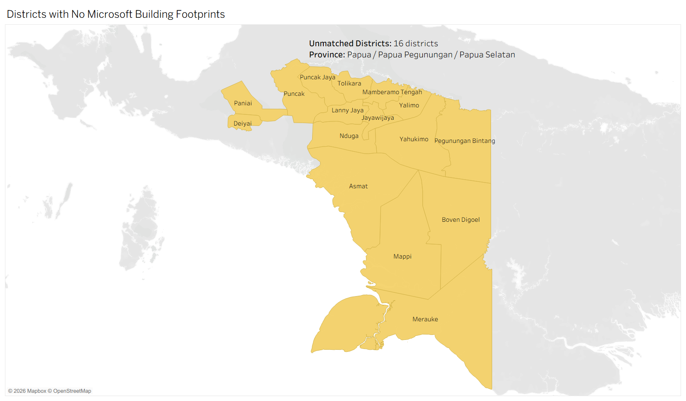

# QuadLake Indonesia

Indonesia building-footprints pipeline built with Polars, GeoPandas, and notebooks.

## Overview

This repository turns Microsoft's global building-footprints release into an Indonesia-focused pipeline that can be inspected, rerun, and validated step by step.

The source data does not come as one clean Indonesia file. It comes from a global link table and many tile-level raw files, and those raw files use a `.csv.gz` extension even though they need to be parsed as NDJSON-style geospatial records rather than normal CSV.

The project includes a Bronze/Silver/Gold pipeline, stage-level validation, a CLI for raw-to-gold runs, and notebooks for download and analysis.

## Data sources

This project currently depends on two upstream sources:

- ADM boundaries source: [geoBoundaries admin boundaries for Indonesia](https://data.humdata.org/dataset/geoboundaries-admin-boundaries-for-indonesia)
- Building footprints source: [Microsoft Global ML Building Footprints](https://github.com/microsoft/globalmlbuildingfootprints)

## Current status

Implemented now:

- [x] Notebook-based Indonesia download flow from the global link table
- [x] Bronze conversion from raw `.csv.gz` files to parquet shards
- [x] Bronze validation for file mapping, metadata consistency, and geometry checks
- [x] Silver conversion with row-level identifiers and geometry normalization
- [x] Silver validation for file mapping and schema checks
- [x] Gold aggregation for country, quadkey, province, and district outputs
- [x] Gold handling for unmatched province and district assignments using nearest-boundary joins
- [x] Gold validation for file existence, total reconciliation, recovered row counts, and boundary-key integrity
- [x] A single command-line entry point for Bronze, Silver, Gold, and raw-to-gold orchestration

Still planned:

- [ ] Building density map analysis in `notebooks/gold_analysis.ipynb`

## Results snapshot

The current Gold outputs support both summary analysis and basic spatial reporting.  
The figures below show the first reporting layer built from district-level Gold outputs in Tableau.

### District building count and density

This figure compares two district-level views of the Microsoft building footprint dataset across Indonesia's ADM2 boundaries.

- **Building count** shows the total number of Microsoft building footprints assigned to each district.
- **Building density** normalizes those counts by district area:

`Microsoft building footprint count / district area (km²)`

The count map uses a log-scaled color ramp to improve readability across highly uneven district totals, while the density map highlights compact, built-up districts rather than simply the districts with the largest land area or total counts.

<p align="center">
  
</p>

**What it shows**
- High total building counts are concentrated in Java and parts of Sumatra, Sulawesi, and Kalimantan.
- The density view reveals a different pattern from raw count, highlighting more compact urban districts and municipalities.
- Several Papua districts fall into the zero-density group because they contain no Microsoft building footprints in the current dataset.

### Top 20 districts by building count and density

This figure compares district rankings by **total building count** and by **building density**.

- The **count ranking** highlights districts contributing the largest raw footprint totals.
- The **density ranking** highlights districts with the highest concentration of footprints per km².

<p align="center">
  
</p>

**What it shows**
- The count leaderboard is dominated by districts with very large total footprint volumes.
- The density leaderboard is dominated more strongly by `Kota` / urban municipalities.
- Comparing the two rankings helps separate **scale** from **intensity**, which is more informative than using raw count alone.

### Districts with no Microsoft building footprints

The pipeline also surfaces districts that contain zero Microsoft building footprints after district assignment.

<p align="center">
  
</p>

**What it shows**
- In the current dataset, 16 districts have no Microsoft building footprints.
- These districts are clustered in Papua / Papua Pegunungan / Papua Selatan.
- This figure is useful both as a data-coverage check and as a boundary-assignment QA view.

### Notes

- These figures are derived from Gold-stage district outputs.
- The current reporting layer is based on district-level administrative summaries, not per-building point rendering.
- The next analysis step is to add building density maps in `notebooks/gold_analysis.ipynb`, starting from the Gold quadkey counts and sampled Silver building points.

## What this project currently does

Implemented:

- reads the global dataset link table from [source_csv/dataset-links.csv](/home/fal10/PycharmProjects/QuadLake%20Indonesia/source_csv/dataset-links.csv)
- filters that link table to Indonesia inside [notebooks/data_download.ipynb](/home/fal10/PycharmProjects/QuadLake%20Indonesia/notebooks/data_download.ipynb)
- downloads Indonesia raw files into `data/raw`
- converts raw files into Bronze parquet shards with `country`, `quadkey`, `upload_date`, and `source_file`
- validates Bronze outputs against raw filenames and geometry expectations
- builds Silver parquet shards with `source_row_index`, `silver_record_id`, `geometry`, and `geometry_type`
- filters Silver rows to valid `Polygon` and `MultiPolygon` geometries
- builds Gold outputs for:
  - country-level building counts
  - quadkey-level building counts
  - province-level building counts
  - district-level building counts
  - unmatched province and district rows
  - nearest-boundary recovery outputs for unmatched rows
- validates that Gold totals reconcile and that final province/district keys match the boundary reference data

Planned next:

- build the density-map analysis

## Data pipeline and architecture

The current workflow is:

1. `source_csv/dataset-links.csv`
2. Notebook filter to Indonesia and download raw files into `data/raw`
3. Bronze conversion from raw NDJSON-style records into parquet shards in `data/bronze/buildings`
4. Bronze validation checks
5. Silver conversion into normalized geometry-focused parquet shards in `data/silver/buildings`
6. Silver validation checks
7. Gold aggregation into summary parquet outputs in `data/gold`
8. Gold validation checks against totals, recovered rows, and administrative boundary keys

More concretely:

- Bronze is file-level ingestion plus metadata extraction from filenames.
- Silver is row-level cleanup and schema shaping for downstream use.
- Gold is where the administrative summaries happen:
  - Polars handles tabular aggregation
  - GeoPandas handles province and district spatial joins
  - Shapely is used to derive representative points from building geometries
  - unmatched rows are written out and then assigned to the nearest boundary as a recovery step

Current Gold outputs include:

- `building_count_country.parquet`
- `building_count_quadkey.parquet`
- `building_counts_by_province.parquet`
- `building_counts_by_district.parquet`
- `building_counts_by_province_unmatched.parquet`
- `building_counts_by_district_unmatched.parquet`
- `building_counts_by_province_unmatched_nearest_adm1.parquet`
- `building_counts_by_district_unmatched_nearest_adm2.parquet`

## Repository structure

Important files and folders:

- [pipeline/bronze.py](/home/fal10/PycharmProjects/QuadLake%20Indonesia/pipeline/bronze.py)
  Bronze conversion and validation logic
- [pipeline/silver.py](/home/fal10/PycharmProjects/QuadLake%20Indonesia/pipeline/silver.py)
  Silver conversion and validation logic
- [pipeline/gold.py](/home/fal10/PycharmProjects/QuadLake%20Indonesia/pipeline/gold.py)
  Gold aggregation, nearest-boundary recovery, and Gold-stage validation logic
- [notebooks/data_download.ipynb](/home/fal10/PycharmProjects/QuadLake%20Indonesia/notebooks/data_download.ipynb)
  Filters the global link table to Indonesia and downloads raw files
- [notebooks/bronze_pipeline.ipynb](/home/fal10/PycharmProjects/QuadLake%20Indonesia/notebooks/bronze_pipeline.ipynb)
  Bronze-stage exploratory build notebook
- [notebooks/bronze_validation.ipynb](/home/fal10/PycharmProjects/QuadLake%20Indonesia/notebooks/bronze_validation.ipynb)
  Bronze-stage validation notebook
- [notebooks/silver_pipeline.ipynb](/home/fal10/PycharmProjects/QuadLake%20Indonesia/notebooks/silver_pipeline.ipynb)
  Silver-stage exploratory build notebook
- [notebooks/silver_validation.ipynb](/home/fal10/PycharmProjects/QuadLake%20Indonesia/notebooks/silver_validation.ipynb)
  Silver-stage validation notebook
- [notebooks/gold_pipeline.ipynb](/home/fal10/PycharmProjects/QuadLake%20Indonesia/notebooks/gold_pipeline.ipynb)
  Gold-stage exploratory build notebook
- [notebooks/gold_validation.ipynb](/home/fal10/PycharmProjects/QuadLake%20Indonesia/notebooks/gold_validation.ipynb)
  Gold-stage validation notebook
- `data/raw`
  downloaded Indonesia raw files
- `data/bronze/buildings`
  Bronze parquet shards
- `data/silver/buildings`
  Silver parquet shards
- `data/gold`
  Gold outputs
- `data/boundaries`
  province and district boundary GeoJSON files used in Gold spatial joins
- `out/images`
  generated analysis images such as `district_count_bar.png` and `district_count_map.png`

Notes:

- [main.py](/home/fal10/PycharmProjects/QuadLake%20Indonesia/main.py) is the command-line entry point for the transformation pipeline.
- The download step stays notebook-based on purpose. It is **very slow**, and I do not want normal pipeline runs to retry it or wait behind it. `main.py` is for Bronze, Silver, and Gold after the raw files are already in place.

## How to run

### 1. Set up the environment

```bash
python3 -m venv .venv
source .venv/bin/activate
pip install -r requirements.txt
```

Dependencies currently listed in [requirements.txt](/home/fal10/PycharmProjects/QuadLake%20Indonesia/requirements.txt):

- `polars`
- `pyarrow`
- `jupyterlab`
- `ipykernel`
- `geopandas`
- `shapely`

### 2. Prepare the data

Current assumption:

- the global link table exists at `source_csv/dataset-links.csv`
- raw Indonesia files are downloaded into `data/raw`
- administrative boundary files exist in `data/boundaries`

The current download flow is notebook-based:

- open [notebooks/data_download.ipynb](/home/fal10/PycharmProjects/QuadLake%20Indonesia/notebooks/data_download.ipynb)
- filter the source link table to Indonesia
- download the raw files into `data/raw`

This step stays in the notebook on purpose. The download is very slow, and retrying it is expensive in time. I do not want `main.py` runs to include that slow step, because it would make normal Bronze/Silver/Gold runs much heavier.

You can check the raw-and-boundary prerequisites before running the pipeline:

```bash
python main.py check-inputs
```

### 3. Run the pipeline stages

Bronze:

```bash
python main.py bronze
```

Silver:

```bash
python main.py silver
```

Gold:

```bash
python main.py gold
```

Run Bronze through Gold in order:

```bash
python main.py all
```

Run a small smoke-test subset:

```bash
python main.py all --max-files 2
```

Each script writes its outputs and runs validation checks before returning.

### 4. Inspect with notebooks

Use JupyterLab for the exploratory and validation notebooks:

```bash
jupyter lab
```

## Known limitations and current gaps

- The download step still lives in a notebook rather than a reusable script.
- The CLI assumes local raw files and boundary files are already present.
- There is still no formal configuration system beyond command-line arguments.
- There is not yet a formal test suite around the pipeline modules.
- Some geospatial choices are practical rather than fully optimized, for example using a general projected CRS for nearest-boundary recovery.

## Next steps

The next planned step is:

- implement the density-map analysis in [notes/quadlake-indonesia-building-density-map-plan.md](/home/fal10/PycharmProjects/QuadLake%20Indonesia/notes/quadlake-indonesia-building-density-map-plan.md)

## License

The original code, notebooks, and documentation in this repository are released under the MIT License.

The data sources used by this project keep their own licenses and are not relicensed by this repository. In particular, Microsoft Global ML Building Footprints and geoBoundaries remain under their original terms, so please check those licenses before redistributing raw data or substantial derived outputs.